# BlueBubbles Version 1.0 architecture

BlueBubbles is a LAN-only encrypted messaging design. PostgreSQL is authoritative,
Redis is transient, the Debian server routes ciphertext and metadata, and plaintext
plus identity private keys belong only to authorised Windows clients. The diagrams
below describe the implemented components and explicitly show the current unbound
desktop-backend seam.

## 1. System context

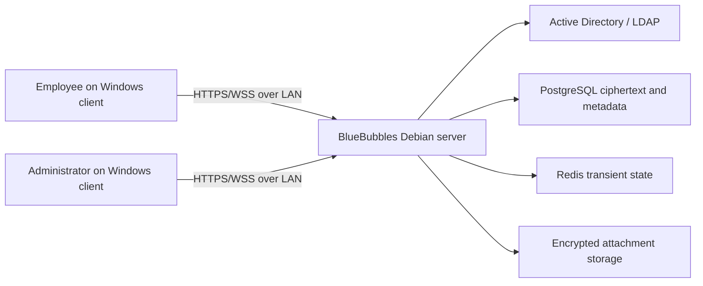

Trust boundary: users trust their local Windows profile and server TLS identity;
they do not trust the server with message/file plaintext or identity private keys.

## 2. Deployment

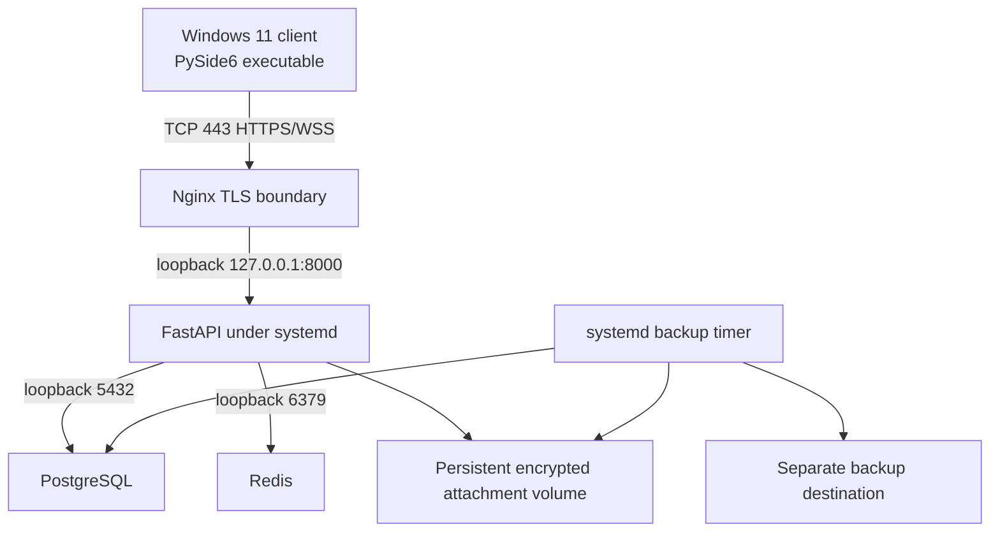

Only 443 is required from client networks. SSH is management-only; ports 5432,
6379, and 8000 must not be reachable from the LAN.

## 3. Server components

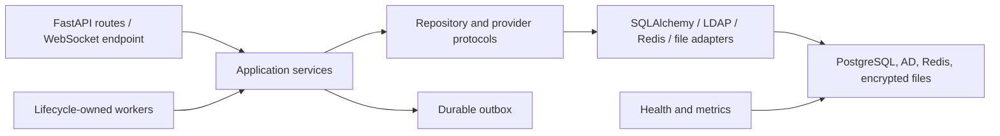

Routes authenticate and translate transport data; services authorise and commit;
repositories never commit, encrypt, log plaintext, or emit UI.

## 4. Client components

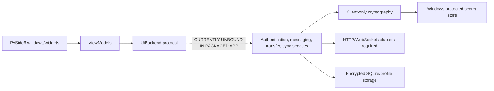

The dotted edge is release blocker `RC-CLIENT-001`: tests inject callback/fake
backends, but the executable constructs `UnavailableUiBackend`.

## 5. Authentication flow

```mermaid
sequenceDiagram
    participant C as Client
    participant S as FastAPI
    participant A as LDAP/local provider
    participant P as PostgreSQL
    participant R as Redis
    C->>S: POST /api/v1/auth/login
    S->>A: Validate credentials
    A-->>S: Provider-neutral identity
    S->>P: Create hashed-token session and audit/outbox records
    S->>R: Register revocation/rate state
    S-->>C: Access token, refresh token, profile, permissions
    Note over C: Password is discarded; tokens enter protected client storage
```

## 6. Message encryption flow

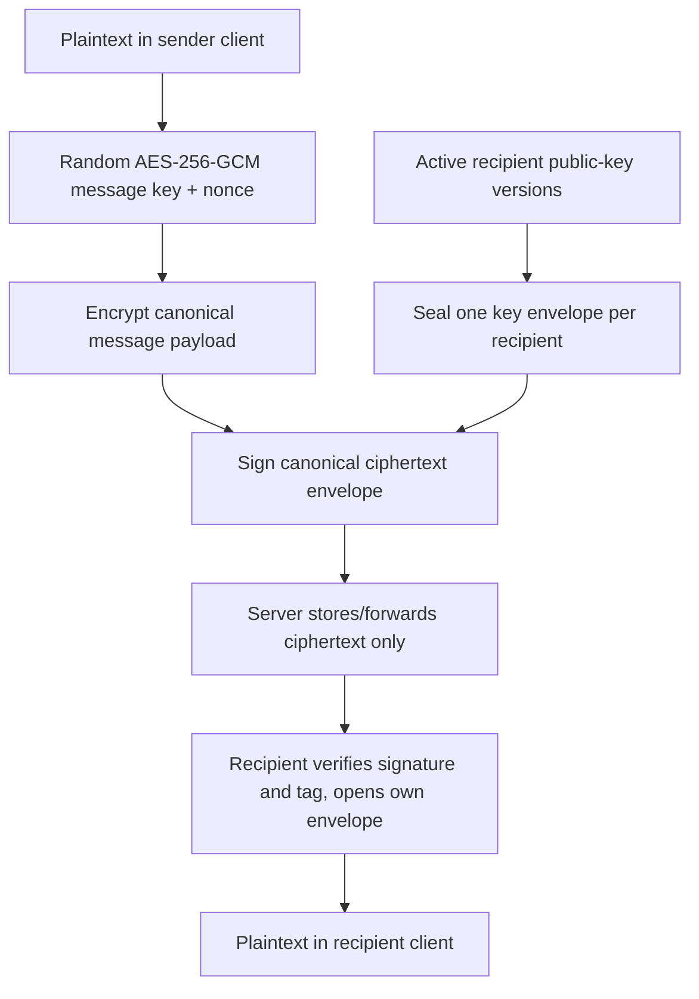

## 7. Message send sequence

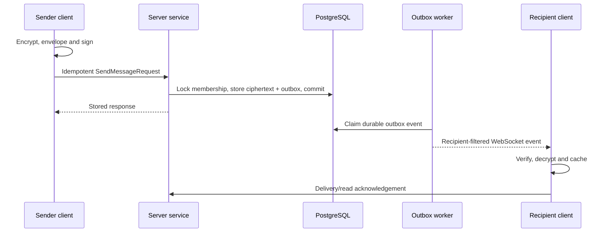

## 8. Attachment upload

```mermaid
sequenceDiagram
    participant C as Client
    participant S as Server
    participant F as Encrypted file store
    C->>C: Hash plaintext; create key and per-chunk nonces
    C->>S: Create encrypted upload manifest
    S-->>C: Missing chunk indexes
    loop missing chunks only
        C->>C: Encrypt and authenticate bounded chunk
        C->>S: Upload ciphertext chunk
        S->>F: Atomically store verified ciphertext
    end
    C->>S: Complete upload
    S-->>C: Authoritative encrypted attachment record
```

## 9. Attachment download

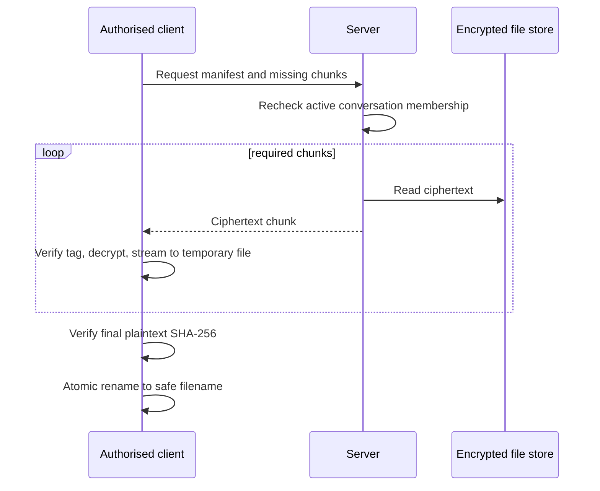

## 10. Offline replay

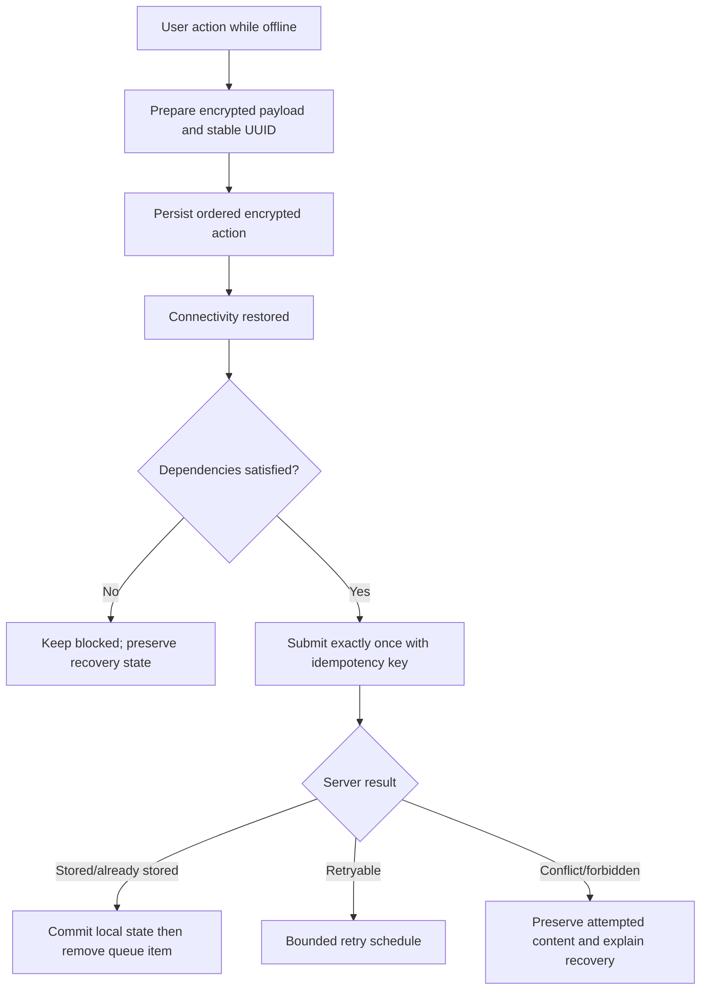

## 11. Database entity relationships

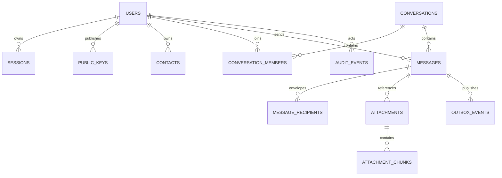

The exact columns, constraints, and migration revisions are documented in
`documentation/development/database-schema-and-migrations.md`.

## 12. Audit-chain flow

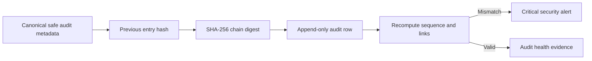

The runtime database role receives `SELECT` and `INSERT`, never audit update/delete.

## 13. Backup and restore

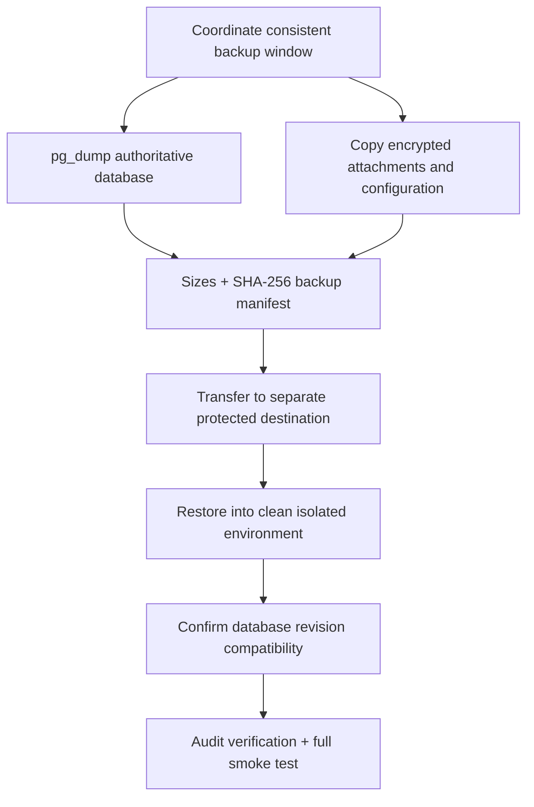

Backup command success without clean restore and application verification is not
accepted evidence.
